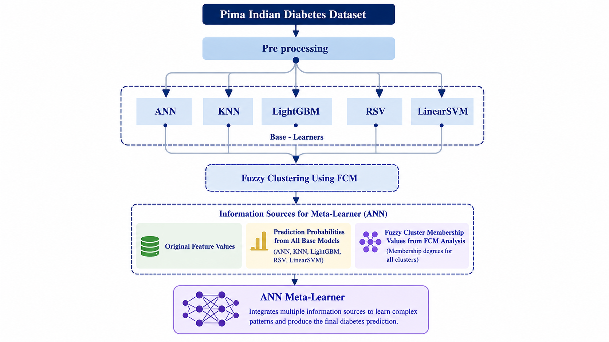

# Diabetes Prediction using Stacked Ensemble Learning with a ANN Meta-Learner
**DOWNLOAD the data from: data/diabetes.csv** then:
[**OPEN THE APP**](https://diabetes-prediction-ghifarkhder.streamlit.app/)
## Overview
This project implements an advanced ensemble learning system for diabetes prediction using a two-phase **Fuzzy C-Means** enhanced **Artificial Neural Network meta-learner**. The system specializes in handling datasets with significant missing values and combines predictions from multiple base machine learning models - including **Artificial Neural Networks** (**ANN**), **K-Nearest Neighbors** (**KNN**), **LightGBM**, **RBF Kernel SVM** (**RSVM**), and **Linear SVM** - to achieve superior performance on the Pima Indians Diabetes dataset.

## Project Structure
```
├── data/
│   ├── diabetes.csv                 # Original dataset
│   └── data-split/
│       ├── train_set.csv           # Initial training set
│       ├── test_set_processed.csv  # Initial training set
│       ├── test_set.csv            # Initial test set
│       ├── train1.csv              # First training partition
│       └── train2.csv              # Second training partition
├── figures/
│   └── data-analysis/
│       ├── missing_values_analysis.png
│       └── correlation_matrix.png
├── saved-models/
│   ├── preprocessors/
│   │   ├── outlier_bounds.json
│   │   ├── skin_thickness_imputer_gb.pkl
│   │   ├── insulin_imputer_gb.pkl
│   │   ├── minmax_scaler.pkl
│   │   └── best_imputation_params.json
│   ├── ANN.keras                   # Base ANN model
│   ├── KNN.pkl                     # Base KNN model
│   ├── LightGBM.pkl                # Base LightGBM model
│   ├── RSVM.pkl                    # Base RBF SVM model
│   ├── LinearSVM.pkl               # Base Linear SVM model
│   ├── MetaLearner_ANN.keras       # Final meta-learner
│   └── fcm_cluster_centers.npy     # FCM cluster centers
├── src/
│   ├── preprocessing/
│   │   ├── data_analysis.py
│   │   ├── data_cleaning_splitting.py
│   │   └── advanced_preprocessing.py
│   ├── models/
│   │   ├── ANN.py
│   │   ├── KNN.py
│   │   ├── LightGBM.py
│   │   ├── RSVM.py
│   │   ├── LinearSVM.py
│   │   └── META-Learner.py
│   ├── interface/
│   │   └── interface.py            # User interface
│   ├── secondary/                  # Hyperparameter search scripts
│   │   ├── ANN-search.py
│   │   ├── KNN-search.py
│   │   ├── LightGBM-search.py
│   │   ├── RSVM-search.py
│   │   └── LSVM-search.py
│   └── test.py                     # Testing script
├── README.md
└── requirements.txt
```

## Dataset
**DATASET LINK:** [Pima Indians Diabetes Dataset](https://www.kaggle.com/datasets/jamaltariqcheema/pima-indians-diabetes-dataset)

The Pima Indians Diabetes Dataset contains medical diagnostic measurements for 768 patients with significant missing values:

**Original dataset**: 768 samples with 9 features
- **After cleaning**: 724 samples (removed cases with missing critical features)
- **After dropping DiabetesPedigreeFunction**: 724 samples with 8 features
- **Training set**: 579 samples (80% split)
- **Test set**: 145 samples (20% split)
- **After outlier removal**: Training: 526 samples, Test: 135 samples

**Significant Missing Values**:
- Training set: SkinThickness (143 missing), Insulin (258 missing)
- Test set: SkinThickness (49 missing), Insulin (74 missing)

## Installation
```bash
# Clone the repository
git clone https://github.com/Ghifar-Khder/Diabetes-Detection
cd Diabetes-Detection

# Install required packages
pip install -r requirements.txt
```

## Usage

### 1. Data Preprocessing
Run the preprocessing pipeline in sequence:

```bash
python src/preprocessing/data_analysis.py
python src/preprocessing/data_cleaning_splitting.py
python src/preprocessing/advanced_preprocessing.py
```

### 2. Hyperparameter Search (Optional)
Run hyperparameter search for each model (uses train1 for training and train2 for validation):

```bash
python src/secondary/ANN-search.py
python src/secondary/KNN-search.py
python src/secondary/LightGBM-search.py
python src/secondary/RSVM-search.py
python src/secondary/LSVM-search.py
```

### 3. Base Model Training
Train the base models with optimal hyperparameters:

```bash
python src/models/ANN.py
python src/models/KNN.py
python src/models/LightGBM.py
python src/models/RSVM.py
python src/models/LinearSVM.py
```

### 4. Meta-Learner Training
```bash
python src/models/META-Learner.py
```

### 5. Testing
Run the test script to evaluate the final model:
```bash
python src/test.py
```

### 6. User Interface
Launch the user interface for interactive predictions:
```bash
python src/interface/interface.py
```

## User Interface features

The application features a user-friendly graphical interface that allows for:

**Input Options:**
- Process CSV files with multiple patient records
- Enter individual patient data through form fields

**Core Features:**
- Single-case testing capability to validate model behavior and understand decision pathways
- Real-time diabetes risk predictions
- Visual indicators showing which values were automatically filled
- Comparison of predictions from all base models
- Performance metrics display for datasets

The interface provides an intuitive way to make predictions using either individual patient data or batch processing of CSV files, with clear visual feedback and comprehensive results display.

## Methodology
### 

### Advanced Data Preprocessing
1. **Missing Value Identification**: Comprehensive analysis revealing significant missing values in SkinThickness (≈20%) and Insulin (≈35%)
2. **Critical Feature Preservation**: Removal of cases with missing values in essential features (Age, Glucose, BloodPressure, BMI)
3. **Feature Selection**: Removal of DiabetesPedigreeFunction based on correlation analysis
4. **Outlier Detection**: IQR method to remove outliers from both training and test sets
5. **Smart Imputation**: Gradient Boosting models specifically tuned for:
   - SkinThickness imputation (143 missing in train, 49 in test)
   - Insulin imputation (258 missing in train, 74 in test)
6. **Feature Scaling**: MinMax scaling applied to all features for model consistency
### Base Models
Five diverse base models were trained to handle the complex missing value patterns:
1. Artificial Neural Network (ANN)
2. K-Nearest Neighbors (KNN)
3. LightGBM (Gradient Boosting)
4. RBF Kernel SVM (RSVM)
5. Linear SVM

### Hyperparameter Optimization
Each model underwent extensive hyperparameter search using:
- Training on train1 partition
- Validation on train2 partition
- Grid search techniques tailored to handle missing value patterns

### Meta-Learner Architecture
The ANN meta-learner integrates multiple information sources:
- Original feature values
- Prediction probabilities from all base models
- Fuzzy cluster membership values from FCM analysis

### Two-Phase Training Strategy
1. **Phase 1**: Initial training using FCM cluster centers from the first data partition (train1)
2. **Phase 2**: Weighted refinement with recalculated FCM centers (2:1 ratio) and weighted loss (5:1 ratio) using both train1 and train2

## Results
The meta-learner demonstrates superior performance compared to individual base models:

| Model | Accuracy | Precision | Recall | F1-Score |
|-------|----------|-----------|--------|----------|
| ANN | 71.11% | 53.97% | 77.27% | 63.55% |
| KNN | 67.41% | 50.00% | 47.73% | 48.84% |
| LightGBM | 72.59% | 57.45% | 61.36% | 59.34% |
| RSVM | 74.81% | 60.87% | 63.64% | 62.22% |
| LinearSVM | 74.07% | 60.98% | 56.82% | 58.82% |
| **Meta-Learner** | **77.04%** | **63.27%** | **70.45%** | **66.67%** |

The meta-learner outperformed the best base model (ANN) by:
- +5.93% in accuracy
- +9.30% in precision  
- −6.82% in recall
- **+3.12% in F1-score**


## Contact
* **Developer:** Ghifar Khder
* **Email:** ghifarkhder2000@gmail.com
* **LinkedIn:** [www.linkedin.com/in/ghifar-khder](https://www.linkedin.com/in/ghifar-khder)
* **Repository:** [Ghifar-Khder/Diabetes-Detection](https://github.com/Ghifar-Khder/Diabetes-Detection)
